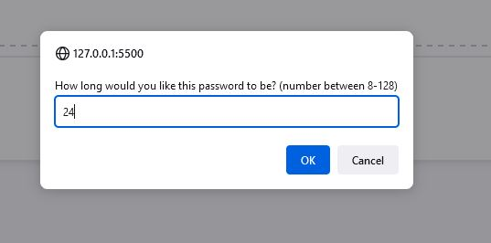
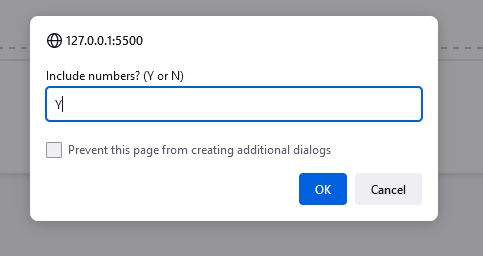
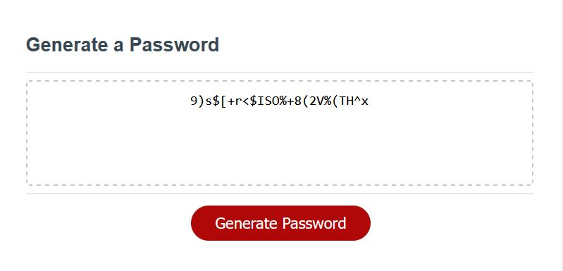

# 03 JavaScript: Password Generator

## Description

A password generator made using HTML, CSS and JavaScript.

After clicking the 'Generate Password' button, the user receives a series of prompts to determine how long the password will be, and what types of characters to be used. Then, using conditional logic, the generated password is printed to the screen where a user can copy it for use.

Multiple functions are created to help keep the code clean and easier to read, by calling them when necessary.

## Mock-Up

The following image shows the web application's appearance and functionality:

## Usage

When page is loaded up, simply press the 'Generate Password' button to begin.

First, select how many characters you want for the password (min of 8, max of 128)

Then you will be asked which TYPES of characters you would like to have in the password. Options being: lower case letters, upper case letters, numbers, and symbols.

Once all that is determined, and there are no missing requirements (too short a length for instance) the password is automatically generated and printed in the text box in the screen.

## Links

- Live Site URL: [live site](https://jon-ledo.github.io/bc-module3-challenge__password-generator/)
